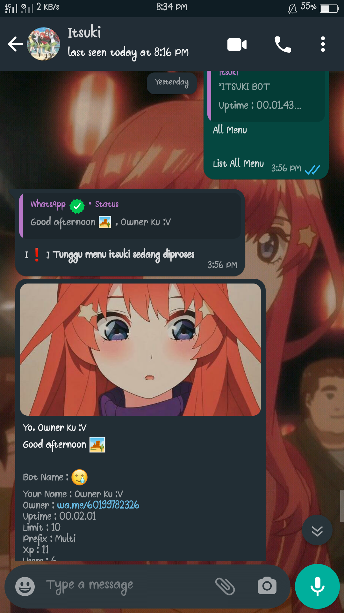

<p align="center">
	
</p>
<h1 align="center">Itsuki Bot</h1>


<a href="https://github.com/Itsuki-chan/Wa/network/members"></a>
<a href="https://github.com/Itsuki-chan/Wa/watchers"></a>
<a href="https://github.com/Itsuki-chan/Wa/stargazers"></a>
<a href="https://github.com/Itsuki-chan/Wa/graphs/contributors"></a>
<a href="https://github.com/Itsuki-chan/Wa/issues"></a>
<a href="https://github.com/Itsuki-chan/Wa/issues?q=is%3Aissue+is%3Aclosed"></a>
<a href="https://github.com/Itsuki-chan/Wa/pulls"></a>
<a href="https://github.com/Itsuki-chan/Wa/pulls?q=is%3Apr+is%3Aclosed"></a>

<h1 align="center">Termux is not supported</h1>

##   Deploy To Heroku
[](https://heroku.com/deploy?template=https://github.com/Itsuki-chan/Wa)

## Want to test?
[](https://wa.me/994406631981)

## For Rdp/Windows/Vps Users

* Install [`Git`](https://git-scm.com/downloads)
* Install [`NodeJS`](https://nodejs.org/en/download)
* Install [`Ffmpeg`](https://ffmpeg.org/download.html) (**Don't Forget to Add FFmpeg to the PATH environment variable**)
* Install [`ImageMagick`](https://imagemagick.org/script/download.php)
```cmd
git clone https://github.com/Itsuki-chan/Wa
cd Wa
npm i
npm update
node .
```

# if you want edit
* Edit owner in this [section](https://github.com/Itsuki-chan/Wa/blob/aac6518cf05fad0e9ff5497933a5481e6ed53f7b/config.js#L2)
* Edit apikey in this [section](https://github.com/Itsuki-chan/Wa/blob/aac6518cf05fad0e9ff5497933a5481e6ed53f7b/config.js#L19)
* Edit packname in this [section](https://github.com/Itsuki-chan/Wa/blob/aac6518cf05fad0e9ff5497933a5481e6ed53f7b/config.js#L31)
* Edit author in this [section](https://github.com/Itsuki-chan/Wa/blob/aac6518cf05fad0e9ff5497933a5481e6ed53f7b/config.js#L32)

# Get Apikeys
* Get Xteam Apikey at this [section](https://api.xteam.xyz)
* Get Itsuki Apikey at this [section](https://itsuki-api.herokuapp.com)

# Edit Background in Menu
Example :


* You can edit in this [section](https://github.com/Itsuki-chan/Wa/blob/aac6518cf05fad0e9ff5497933a5481e6ed53f7b/config.js#L37)

---------

## For Heroku Users

### Instal Buildpack
* heroku/nodejs
* https://github.com/jonathanong/heroku-buildpack-ffmpeg-latest.git
* https://github.com/DuckyTeam/heroku-buildpack-imagemagick.git

---------

## Arguments for `node . [--options] [<session name>]`

#### Contoh: `node . --self --restrict --autoread`

### `--self`

Enable self mode (Ignore others)

### `--prefix <prefixes>`

* `prefixes` separated by each character
Set prefix

### `--server`

Used for [heroku](https://heroku.com/) or scan through the website

### `--db <json-server-url>`

Use external db instead of local db, 
Example Server `https://json-server.adiixyz.repl.co/`
* Code: [Code](https://repl.it/@Nurutomo/json-server)

`node . --db 'https://json-server.adiixyz.repl.co/'`

The server must have specifications like this

#### GET

```http
GET /
Accept: application/json
```

#### POST

```http
POST /
Content-Type: application/json

{
 data: {}
}
```

### `--big-qr`

If small unicode qr doesn't support

### `--restrict`

Activate restricted plugins (which may cause your number to be **blocked** if used too often)

* Group Administration `add, kick, promote, demote`

### `--img`

Enable image checker via terminal

### `--autoread`

If enabled, all incoming messages will be marked as read

### `--nyimak`

No bots, just print the received message and add the user to the database

### `--test`

**Development** Testing Mode

### `--trace`

```js
conn.logger.level = 'trace'
```

### `--debug`

```js
conn.logger.level = 'debug'
```

---------

 [](https://github.com/ariffb25) | [](https://github.com/Adiixyz)
----|----
[ariffb](https://github.com/ariffb25) | [Adiixyz](https://github.com/Adiixyz)
 Author / Creator | Rewriter
